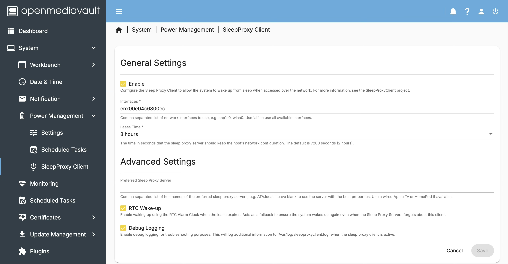

# openmediavault Plugin for a Bonjour Sleep Proxy Client Implementation

This plugin allows your NAS to save energy by going to sleep when not in use. A Sleep Proxy Server—typically an Apple TV or HomePod—will wake the device using Wake-on-LAN (WOL) as soon as a port matching an advertised service is accessed. See http://en.wikipedia.org/wiki/Bonjour_Sleep_Proxy for more details.

The plugin uses the SleepProxyClient implementation from:
https://github.com/awein/SleepProxyClient

## Features

Customizable:

* Network interfaces to use
* Lease time
* Preferred proxy servers
* RTC wake-up as a fallback

## Installation

Download the `.deb` package from the [**Releases**](https://github.com/lisanet/openmediavault-sleepproxyclient/releases) page and install it:

```
sudo dpkg -i <packagename.deb>
```

## Dependencies

This plugin depends on the openmediavault autoshutdown plugin: https://github.com/OpenMediaVault-Plugin-Developers/openmediavault-autoshutdown

Please install the autoshutdown plugin before installing this one.

## Usage

The plugin uses reasonable defaults and should work out of the box. However, it is recommended to adjust the lease time based on your typical NAS usage. For example, if you only use your NAS during the day, a lease time of 8 hours may be a good choice so the NAS can sleep at night.

### General Settings

#### Interfaces

Specifies which network interfaces to use. By default, all interfaces are used.
You can specify a comma-separated list of interfaces, for example: `enp1s0,wlan0`. Use `all` to include all available interfaces.

#### Lease Time

The lease time (or TTL) controls the lifetime of the mDNS announcement. The host running SleepProxyClient will be woken up by the Sleep Proxy Server after this period to renew the announcement. The default value is 2 hours.

### Advanced Settings

#### Preferred Sleep Proxy Servers

By default, the Sleep Proxy Server with the best properties is selected. The order of servers with identical properties is undefined. This option allows you to specify preferred Sleep Proxy Servers, which will be prioritized.

A common use case is to prefer a wired Apple TV over a HomePod with weak Wi-Fi coverage. Both may advertise the same properties, but prioritizing the Apple TV can improve reliability.

#### RTC Wake-up

Enables waking up using the RTC alarm clock when the lease expires. This acts as a fallback to ensure the system wakes up even if the Sleep Proxy Server forgets about the client (which is unlikely).

#### Debug Logging

Enables debug logging for troubleshooting purposes. Additional information will be written to `/var/log/sleepproxyclient.log` when the client is active.

## Screenshot

To give you an impression of the plugin's UI:



## Additional Documentation

For more information about the Bonjour Sleep Proxy Service please visit the wiki of the SleepProxyClient package.
See https://github.com/awein/SleepProxyClient/wiki

## Uninstall

To completely remove the plugin, including configuration files and helper scripts, run:

```
sudo apt purge openmediavault-sleepproxyclient
```

## License

This plugin is licensed under the **MIT License**.

The submodule `SleepProxyClient` is licensed under the **GPL v3**.

## Contributing

Bug reports, feature suggestions, and pull requests are welcome.

## Disclaimer

This plugin is provided **"as is"**, without warranty of any kind.
Always verify results and keep backups of your original data.
